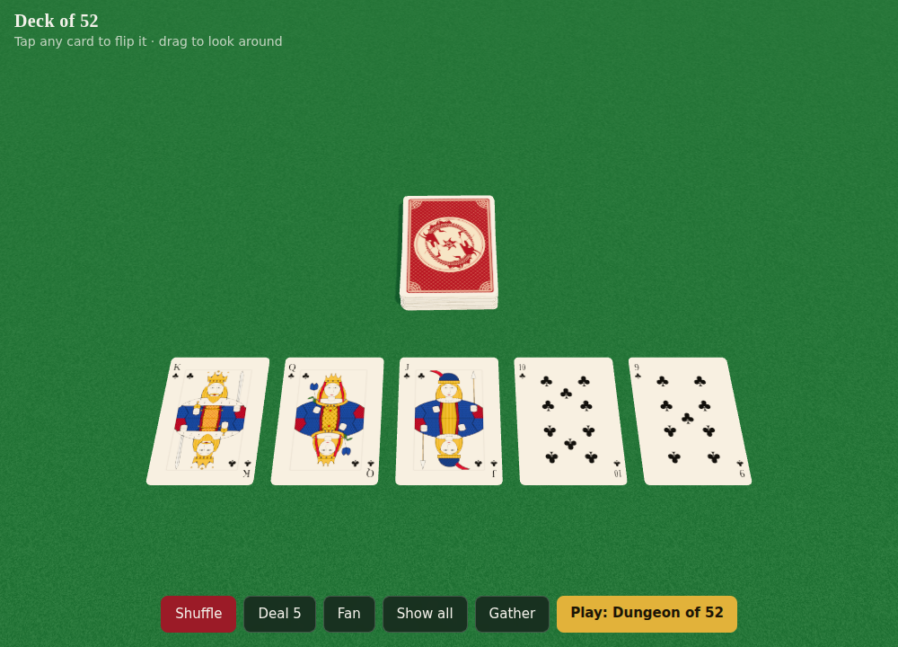
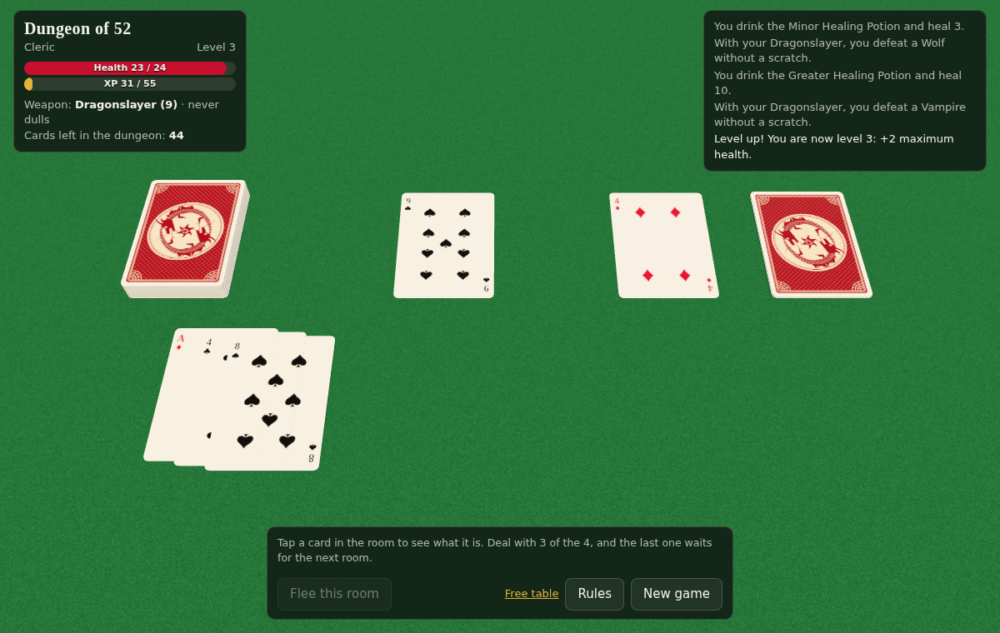

# Deck of 52

*Deck of 52* is the working name for this card game. So far it is a 3D deck of 52 playing cards with a dragon on the back, made with [three.js](https://threejs.org).

The card faces follow a real printed deck: traditional pip shapes and layouts, corner indices, and court cards in the classic "English pattern" style. The kings, queens and jacks are drawn in fine black linework over flat red, blue and yellow, and three of them are shown in profile.

## Play: Dungeon of 52

Open `dungeon.html` for a card RPG played with the whole deck. It is a solo dungeon crawl inspired by the card game *Scoundrel*, with some RPG additions: hero classes, XP and levels, named monsters and bosses, and allies.

- The deck is the dungeon. Each **room** is four cards; deal with any three, and the fourth stays for the next room.
- **♠ ♣ are monsters.** 2–10 are worth their number. Jacks, queens, kings and aces are **bosses** (11–14); the Ace of Spades is the Dragon.
- **♦ are weapons.** A weapon takes its strength off the damage from each fight. Every kill dulls it, though: afterwards it only works on monsters no stronger than the last one it killed.
- **♥ are potions.** Only the first one in each room works.
- **The red jacks, queens, kings and aces are allies:** the Healer, the Priestess, the Paladin King's holy shield, the Phoenix Feather, the Blacksmith, the Enchantress, the Royal Armoury and the Dragonslayer blade.
- **Flee** an untouched room to send it to the bottom of the deck, but not twice in a row.
- Choose a **Knight** (more health), a **Rogue** (flees freely) or a **Cleric** (better potions). Monsters give XP, and each level adds 2 maximum health. Clear the deck to win. Your best score for each hero is remembered in your browser.

## Free table

Open `index.html` (it needs an internet connection to load three.js) to play with the deck itself:

- **Shuffle** – split the deck and riffle it back together in a random order
- **Deal 5** – deal the top five cards and turn them over
- **Fan** – spread the whole deck face up in an arc
- **Show all** – lay out all 52 cards by suit
- **Gather** – stack the deck again
- Tap any card to flip it; drag to look around, pinch or scroll to zoom

`art-preview.html` shows every card picture flat, for checking the artwork.

## How it's made

| File | What it does |
| --- | --- |
| `cardArt.js` | Paints each card face and the dragon back onto a 2D canvas, using code only (no image files). `POSE` sets what each king, queen and jack holds and which way they face |
| `table.js` | The shared 3D table: turns those pictures into textures on thin rounded card models, animates them and handles taps |
| `rules.js` | The rules of Dungeon of 52, with no drawing code, so they can also be run on their own (for example in Node, to simulate games) |
| `dungeon.html` | The RPG: lays the game out on the table and shows your health, XP, weapon and the story so far |
| `index.html` | The free table: shuffle, deal, fan and flip the deck |
| `art-preview.html` | A flat sheet of all the card art |
| `previews/` | Screenshots |
